# DevOps Test Task - GKE Deployment (Staging + Production)

## 1. Context

This document describes the end-to-end flow used to deploy the Online Boutique microservices app to Google Kubernetes Engine (GKE) for the test task.

- Cloud provider: GCP
- Project ID: `flash-aviary-488614-c1`
- Repository: `microservices-demo`
- IaC tool: Terraform
- Environments: `staging`, `production` (separate Kubernetes namespaces)

## 2. High-Level Architecture

- 1 GKE cluster: `online-boutique`
- Location: `us-central1-a` (zonal)
- Cluster type: Standard (not Autopilot)
- Node pool: `online-boutique-node-pool`
  - Machine type: `e2-standard-4`
  - Node count: `2`
- Namespaces:
  - `staging`
  - `production`
- Deployment source: `kustomize/` manifests applied per namespace
- Public access:
  - `frontend-external` LoadBalancer service in each namespace
- Monitoring:
  - Cloud Monitoring custom dashboards for reliability, scalability, and workload traffic/health

## 3. Terraform Changes Made

Main files updated:

- `terraform/main.tf`
- `terraform/variables.tf`
- `terraform/terraform.tfvars`
- `terraform/output.tf`
- `terraform/memorystore.tf` (format-only alignment from `terraform fmt`)

Key implementation points:

1. Added support for multiple namespaces via:
   - `environment_namespaces` variable
   - looped `null_resource` for namespace creation, deployment apply, readiness checks
2. Replaced Autopilot cluster with Standard GKE:
   - `google_container_cluster` with `remove_default_node_pool = true`
   - explicit `google_container_node_pool`
3. Improved readiness logic:
   - rollout-based checks per Deployment
   - excluded `loadgenerator` from rollout gating
4. Added `triggers` on `null_resource` blocks so re-deploy is forced after cluster replacement.

## 4. Deployment Flow (Step-by-Step)

### 4.1 Prerequisites

1. Logged in to GCP account with sufficient permissions.
2. Billing enabled for project `flash-aviary-488614-c1`.
3. Terraform installed.

### 4.2 Configure Terraform

In `terraform/terraform.tfvars`:

- `gcp_project_id = "flash-aviary-488614-c1"`
- `region = "us-central1-a"`
- `environment_namespaces = ["staging", "production"]`
- `node_machine_type = "e2-standard-4"`
- `node_count = 2`

### 4.3 Apply Infrastructure and Deploy Workloads

From `terraform/` directory:

```bash
terraform init
terraform plan
terraform apply -auto-approve
```

Terraform flow:

1. Enable required GCP APIs.
2. Create GKE cluster + node pool.
3. Fetch cluster credentials.
4. Create namespaces (`staging`, `production`).
5. Apply kustomize manifests to both namespaces.
6. Wait for deployment rollouts.

### 4.4 Validate Deployment

Validation commands:

```bash
kubectl get ns
kubectl get deploy -n staging
kubectl get deploy -n production
kubectl get svc -n staging frontend-external
kubectl get svc -n production frontend-external
```

HTTP checks:

```bash
curl -I http://136.115.249.87
curl -I http://34.44.4.150
```

At deployment time, both frontends returned HTTP `200`.

Current frontend public IPs (latest deployment):

- `staging`: `136.115.249.87`
- `production`: `34.44.4.150`

## 5. Issues Encountered and Fixes

### Issue 1: Old metrics API check failed

- Symptom:
  - `apiservice/v1beta1.metrics.k8s.io` not found.
- Root cause:
  - Legacy API version check incompatible with current cluster behavior.
- Fix:
  - Removed APIService wait and switched to deployment rollout-based readiness checks.

### Issue 2: Autopilot scheduling instability and failed scale-up

- Symptom:
  - Many pods stuck in `Pending`.
  - Events showed `FailedScaleUp`, `Insufficient cpu`, and quota-related scale-up failures.
- Root cause:
  - Autopilot scale decisions + environment quota/capacity conditions caused blocked scheduling.
- Fix:
  - Migrated to Standard zonal cluster with explicit fixed node pool (`e2-standard-4`, 2 nodes).

### Issue 3: Cluster replacement blocked by deletion protection

- Symptom:
  - Terraform could not destroy existing cluster due to `deletion_protection = true`.
- Root cause:
  - Existing state/resources had protection enabled.
- Fix:
  - Set `deletion_protection = false` in cluster resource and corrected Terraform state to allow replacement.

### Issue 4: `null_resource` steps did not re-run after cluster replacement

- Symptom:
  - New cluster created, but apply/deploy steps were not forced.
- Root cause:
  - `null_resource` had no `triggers` tied to cluster identity.
- Fix:
  - Added `triggers` using cluster ID and dependency IDs to force namespace/app re-apply when cluster changes.

### Issue 5: `loadgenerator` affects generic pod readiness

- Symptom:
  - Full `pods --all` waits were unreliable for environment readiness.
- Root cause:
  - `loadgenerator` behavior is not a strict readiness signal for platform health.
- Fix:
  - Readiness gate now checks rollout status of business deployments and excludes `loadgenerator`.

## 6. Terraform Destroy (Cleanup)

To remove created infrastructure:

```bash
cd terraform
terraform destroy -auto-approve
```

This satisfies the task requirement to remove provisioned cloud resources after completion.

## 7. Evidence and Deliverables Checklist (per PDF)

### Completed in this repository

- [x] Terraform deploys infrastructure
- [x] Terraform can destroy infrastructure
- [x] `staging` + `production` namespaces deployed
- [x] Frontend exposed for both environments
- [x] CI/CD for 2 microservices (`frontend`, `paymentservice`) with build + push + deploy to `staging` and `production`
- [x] 2-3 useful monitoring/observability dashboards (reliability + scalability)
- [x] High-level architecture description included
- [x] Issues and solutions documented

### Remaining for full final submission package

- [x] Screenshots:
  - [x] deployed system in cloud
  - [x] CI/CD setup
  - [x] dashboards
- [ ] Recorded end-to-end demo video with voice explanation

## 8. Task 2 - CI/CD for 2 Services (GitHub Actions)

Workflow file:

- `.github/workflows/task2-gke-cicd.yaml`

Implemented services:

- `frontend`
- `paymentservice`

### 8.1 CI/CD Behavior

1. On push to `main` (changes in `src/frontend` or `src/paymentservice`):
   - build Docker images for both services
   - push images to Artifact Registry:
     - `us-central1-docker.pkg.dev/flash-aviary-488614-c1/online-boutique/frontend:<sha>`
     - `us-central1-docker.pkg.dev/flash-aviary-488614-c1/online-boutique/paymentservice:<sha>`
   - deploy both images to `staging` namespace in GKE
   - wait for rollout success (`kubectl rollout status`)
2. On manual run (`workflow_dispatch`):
   - `target_environment=staging` -> deploy to `staging`
   - `target_environment=production` -> deploy to `production`
   - production deployment is restricted to runs from `main`

Deployment strategy for both namespaces:

- `kubectl set image` on:
  - `deployment/frontend` container `server`
  - `deployment/paymentservice` container `server`
- then rollout checks for both deployments.

### 8.2 GitHub Configuration Required

Required GitHub secrets:

- `GCP_SA_KEY`: JSON key of `github-actions-cicd@flash-aviary-488614-c1.iam.gserviceaccount.com`

Recommended GitHub environments:

- `staging`
- `production` (optionally protected with required reviewers for manual approval).

Minimum IAM roles for the service account:

- `roles/artifactregistry.writer` (or `roles/artifactregistry.admin` if allowing repo creation by pipeline)
- `roles/container.developer` (or `roles/container.admin`)

Authentication note:

- Pipeline authentication uses `google-github-actions/auth` with `credentials_json: ${{ secrets.GCP_SA_KEY }}`.

### 8.3 CI/CD Issues Encountered and Fixes

Issue 1: Artifact Registry repository may not exist in a fresh project.

- Symptom: image push fails with repository not found.
- Fix: added idempotent repository bootstrap step in workflow (`describe` then `create` when missing).

Issue 2: Deployment update can fail if container names are incorrect.

- Symptom: `kubectl set image` fails when using service name as container name.
- Fix: used the actual container name `server` from manifests for both deployments.

Issue 3: Unsafe production release path from non-main branches.

- Symptom: manual workflows can be triggered from any selected ref.
- Fix: production job validates `main` branch before deploying.

## 9. Task 3 - Cloud Monitoring Dashboards (Reliability/Scalability)

Implemented dashboard assets:

- `monitoring/dashboards/reliability-dashboard.json`
- `monitoring/dashboards/scalability-dashboard.json`
- `monitoring/dashboards/traffic-dashboard.json`
- `monitoring/deploy_dashboards.sh` (idempotent apply script)

### 9.1 Deployed Dashboards

Project: `flash-aviary-488614-c1`

- `Task3 - Reliability Overview` (`12471f21-bec7-46f8-8f75-a4afa882c296`)
- `Task3 - Scalability and Capacity` (`f9552b2f-2bb7-43e4-bc7a-124421a1c63e`)
- `Task3 - Traffic and Workload Health` (`6f3eb770-4a74-4ca2-aaae-f26cbc7ae44c`)

### 9.2 Deployment Flow

```bash
./monitoring/deploy_dashboards.sh flash-aviary-488614-c1
```

What the script does:

1. Reads each dashboard JSON and its `displayName`.
2. Updates an existing dashboard with the same `displayName` (if present).
3. Creates the dashboard from JSON if it does not already exist.

### 9.3 Reliability/Scalability Focus Covered

- Reliability:
  - container restart behavior
  - desired vs available deployment replicas (`frontend`, `paymentservice`)
  - unschedulable pod pressure
- Scalability/Capacity:
  - CPU and memory request utilization
  - node allocatable CPU/memory utilization
- Workload traffic/health:
  - pod network ingress/egress throughput
  - container uptime trend

### 9.4 Issue Encountered and Fix

Issue: Monitoring API rejected filters using mixed `AND` + `(A OR B)` for resource labels.

- Symptom:
  - `INVALID_ARGUMENT ... AND and OR cannot be mixed for 'resource.label' restrictions`
- Root cause:
  - namespace filters were written as `(namespace="staging" OR namespace="production")`.
- Fix:
  - replaced with `resource.label.namespace_name=one_of("staging","production")` (and equivalent for `prometheus_target` namespace label).

## 10. Screenshots Evidence

### 10.1 Deployed System in Cloud

GKE Cluster Overview (`online-boutique`, `us-central1-a`):

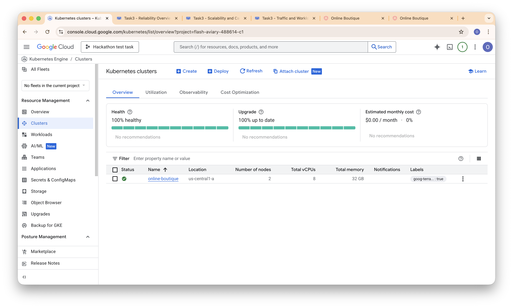

Namespaces and frontend services/IPs:

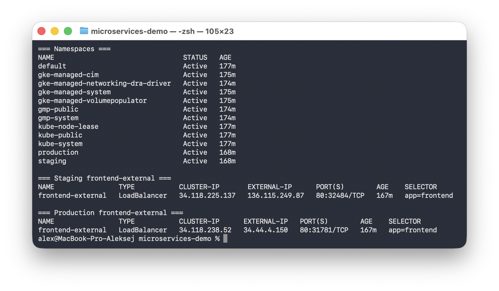

Staging frontend opened:

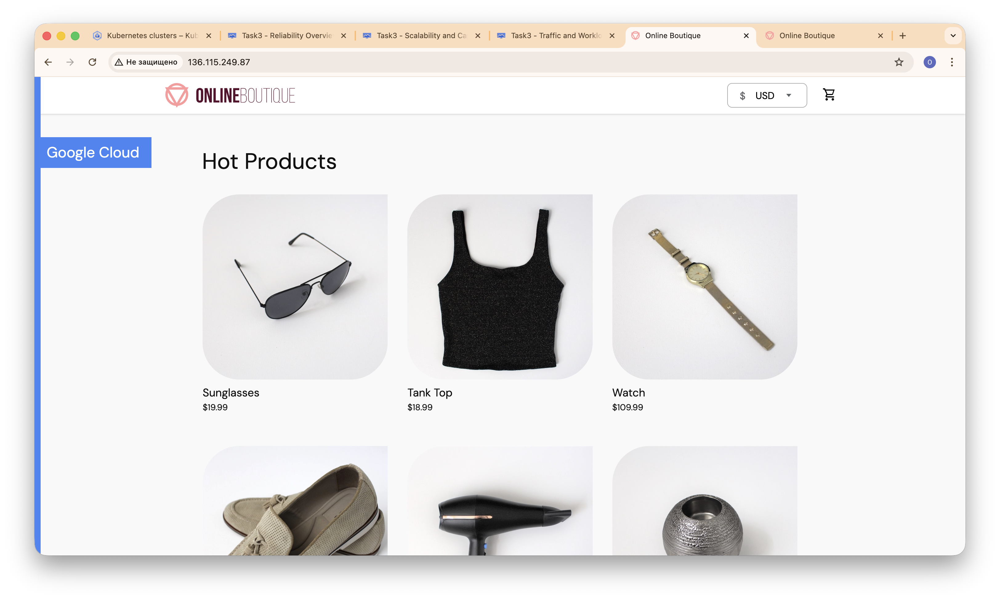

Production frontend opened:

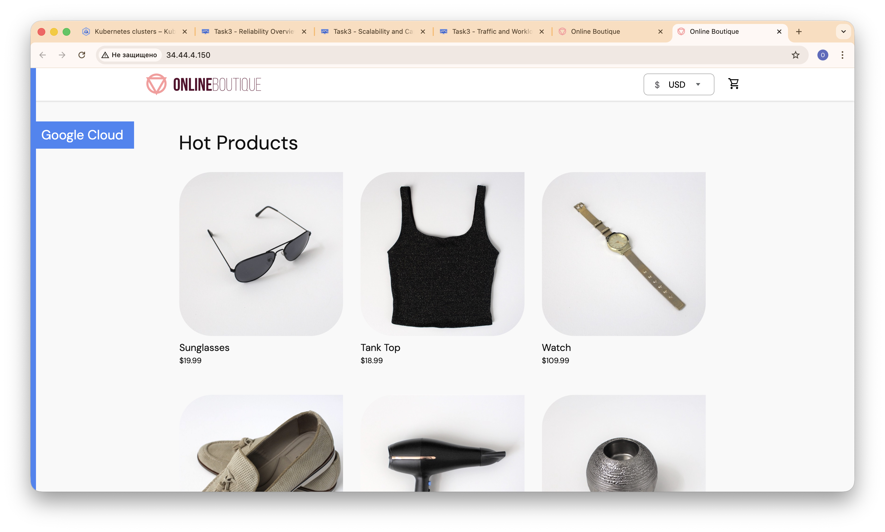

### 10.2 CI/CD Setup and Runs

GitHub Actions workflow page:

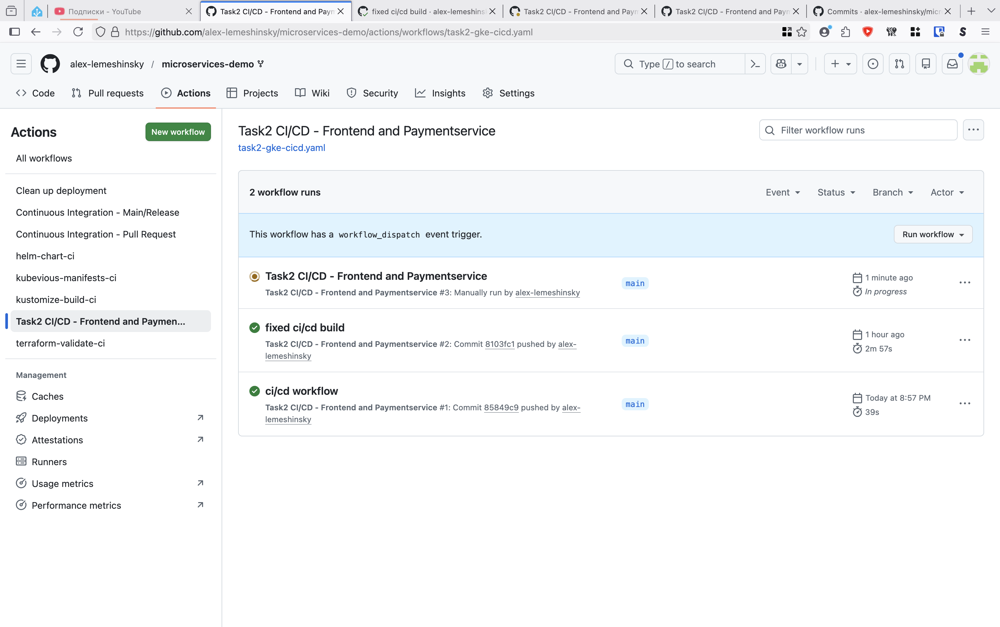

Successful staging deployment run:

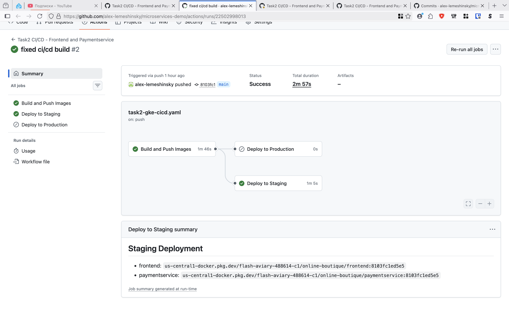

Artifact Registry images/tags:

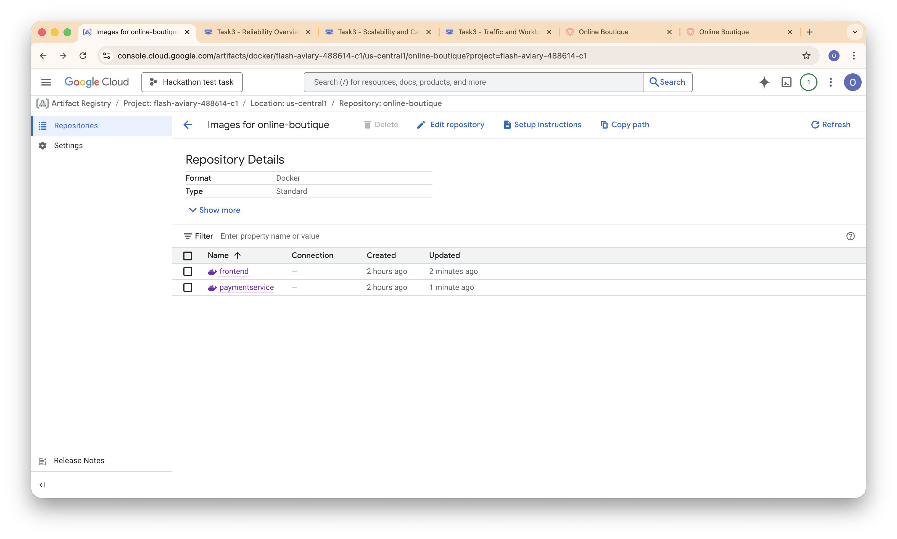

### 10.3 Monitoring Dashboards

Dashboards list in Cloud Monitoring:

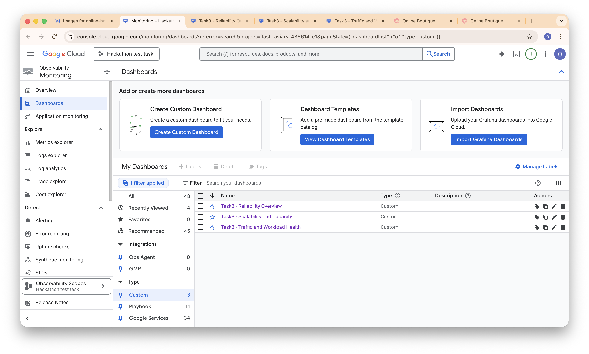

Reliability dashboard:

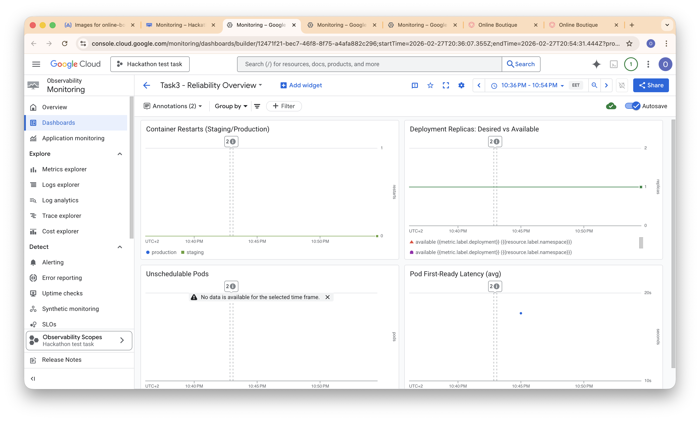

Scalability dashboard:

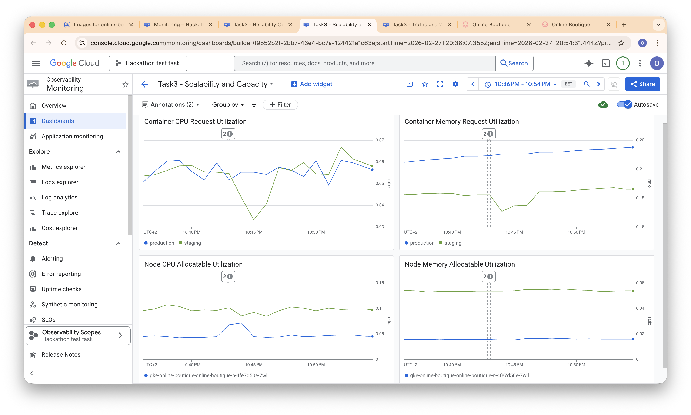

Traffic and workload health dashboard:

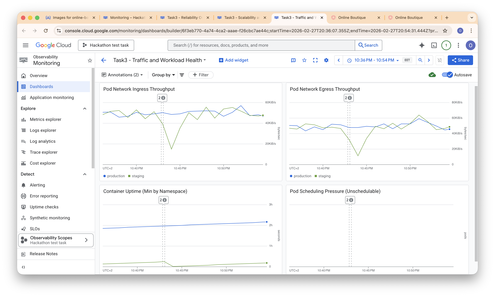
